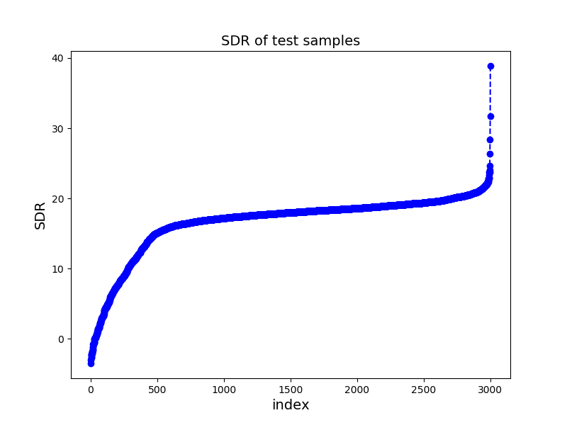

# Conv-TASNET:
## Model with SDR = 16.7 (15.0 in the paper) on WJS0-2speaker dataset
You can find the oringnal paper [TasNet: Surpassing Ideal Time-Frequency Masking for Speech Separation](https://arxiv.org/abs/1809.07454). The testing results are shown as follows: 
### Function
- dataset.py: read the data into the model 
- Tasnet_model.py：the forword network
- Tasnet_train.py：the main function to run
- trainer.py：calculate the loss and for training and testing
- utils.py： process the raw audio and other useful functions
- train.yaml: all the parameters used in the model
- test.py：separate the mixed audio and calculate SDR
- loss/convTasnet_batch_12.file: the loss for each epoch during training stage
- loss/test_SDR.file: the SDR on the testing set (step by 10 samples)
- log/: the loss curves for tensorboard
### Training stage：
- from the beginning: remove the line with "trainer.rerun" in Tasnet_train.py, use "trainer.run" instead
- from a trained model: remove the line with "trainer.run" in Tasnet_train.py，use "trainer.rerun" instead, and change the "model_path" in train.yaml/temp
